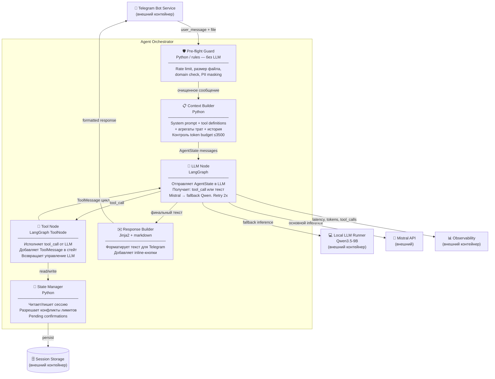

# C4 Component Diagram — Agent Orchestrator

> Уровень: внутреннее устройство Agent Orchestrator — ядра системы.



## Граф состояний LangGraph (ReAct)

```
START
  ↓
[pre_flight_guard] ──→ rate_limit / out_of_domain / file_too_large
  │                         ↓
  │                    [refusal_node] ──→ END
  ↓
[context_builder]   ← загружает AgentState из Session Storage
  ↓
╔══════════════════════════════╗
║   ReAct Loop                 ║
║                              ║
║  [llm_node]                  ║
║     │                        ║
║     ├── tool_call → [tool_node] → добавить ToolMessage
║     │                               │
║     │        ошибка инструмента?    │
║     │          ↓ да                 │
║     │      добавить error msg       │
║     │                               │
║     └───────────────────────────────┘ цикл
║     │
║     └── финальный текст → выход
║
║  Stop conditions:
║  • нет tool_call в ответе
║  • достигнут max_steps (10)
║  • Mistral + Qwen оба упали
╚══════════════════════════════╝
  ↓
[response_builder]
  ↓
[state_manager] → сохранить историю в Session Storage
  ↓
END
```

## Инструменты, доступные LLM

LLM получает tool definitions в system prompt и сам решает что и когда вызвать:

| Tool | Описание | Когда LLM вызывает |
|------|----------|-------------------|
| `load_transactions` | Получить транзакции пользователя из сессии | Когда нужны данные о тратах |
| `categorize_transaction` | Определить категорию по merchant | При нечёткой категоризации |
| `set_limit` | Установить лимит по категории и периоду | При явном запросе лимита |
| `check_limits` | Проверить нарушения лимитов | При анализе трат |
| `find_cheaper` | Найти альтернативу дешевле | При рекомендациях экономии |
| `check_refund` | Проверить возможность возврата | При рекомендации возврата |
| `get_report` | Получить агрегированный отчёт за период | При запросе отчёта |
| `save_pending_confirmation` | Сохранить ожидающее подтверждение | При уверенности < 0.8 |
