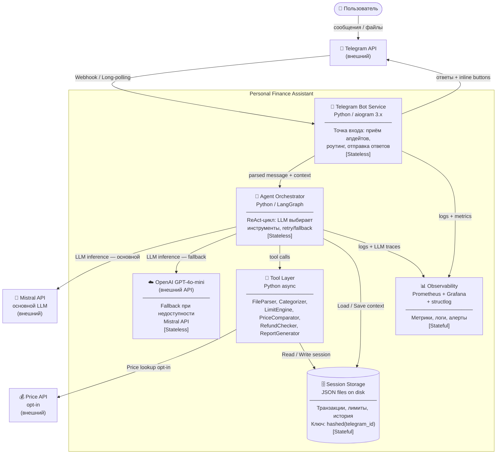

# C4 Container Diagram — PFA

> Уровень: контейнеры внутри PFA — процессы, хранилища, их взаимодействие.

## Ключевые свойства контейнеров

| Контейнер | Масштабирование | Состояние |
|-----------|----------------|-----------|
| Telegram Bot Service | Горизонтально (несколько инстансов) | Stateless |
| Agent Orchestrator | Горизонтально | Stateless (состояние в Session Storage) |
| OpenAI GPT-4o-mini (fallback) | Внешний API | Stateless |
| Tool Layer | Часть Orchestrator процесса | Stateless |
| Session Storage | Вертикально (PoC: JSON; prod: Redis/SQLite) | Stateful |
| Observability | Отдельный Docker Compose stack | Stateful |
