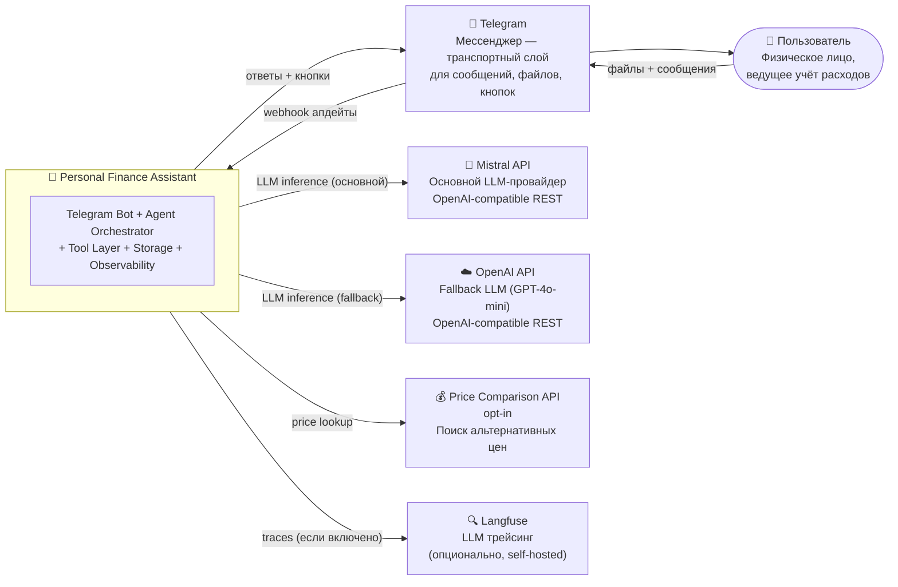

# C4 Context Diagram — PFA

> Уровень: система целиком, пользователи, внешние сервисы и границы.

## Границы системы

**Внутри PFA:**
- Telegram Bot сервер (aiogram)
- Agent Orchestrator (LangGraph)
- Все бизнес-компоненты (Categorizer, Limit Engine, Report Generator и др.)
- OpenAI GPT-4o-mini — fallback при недоступности Mistral API (внешний API)
- Session Storage (JSON-файлы)
- Observability stack (Prometheus, Grafana)

**Вне PFA (внешние системы):**
- Telegram: только транспорт, PFA не хранит Telegram-данные
- Mistral API: основной LLM; при таймауте/ошибке → fallback на OpenAI GPT-4o-mini
- Price API: опционально, с fallback на оффлайн-базу

**Вне scope PoC:**
- Банковские API в реальном времени
- Push-уведомления (планируется фаза 2)
- Мобильное приложение
