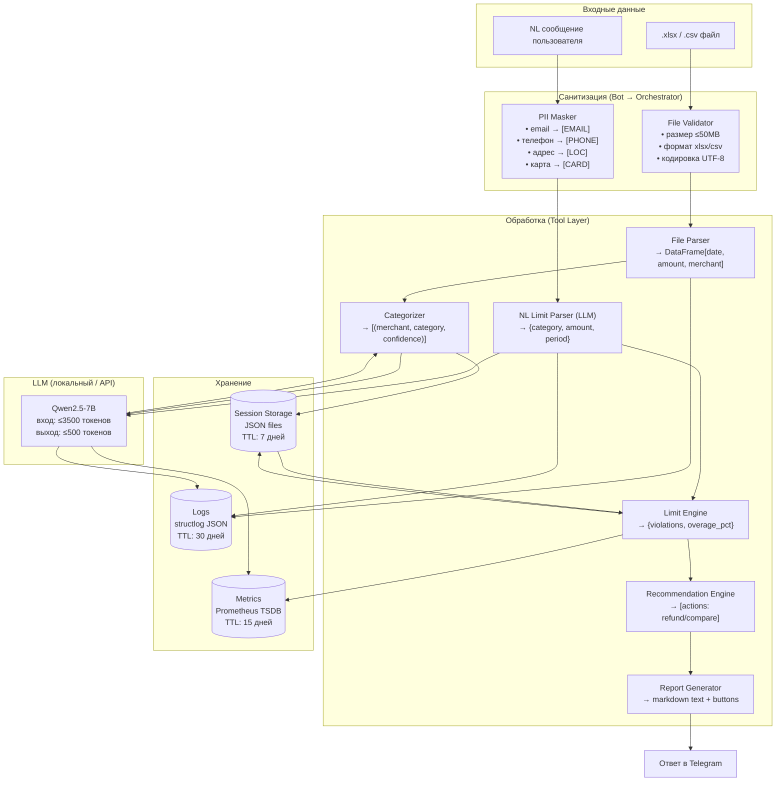

# Data Flow Diagram — PFA

> Как данные проходят через систему, что хранится, что логируется.

## Основной поток данных



## Что хранится и где

| Данные | Хранилище | TTL | Формат | Чувствительность |
|--------|-----------|-----|--------|-----------------|
| Транзакции пользователя | JSON-файл на диске | 7 дней | `[{date, amount, merchant, category}]` | 🔴 Высокая |
| Лимиты пользователя | JSON-файл на диске | До удаления | `{category: {amount, period}}` | 🟡 Средняя |
| История диалога | In-memory + JSON | Текущая сессия (≤10 сообщений) | `[{role, content}]` | 🟡 Средняя |
| Telegram ID | Только хэш (SHA-256+salt) | TTL сессии | HEX string | — (не восстановим) |
| Логи запросов | JSON log files | 30 дней | structlog JSON | 🟡 Средняя (без PII) |
| LLM метрики | Prometheus | 15 дней | Time series | 🟢 Низкая |
| Оффлайн-база цен | Docker volume | Обновляется вручную | JSON (~10K записей) | 🟢 Низкая |

## Что НЕ хранится

- ❌ Telegram username, имя, фамилия
- ❌ Сырые NL-сообщения (только распознанные параметры)
- ❌ Исходные файлы после парсинга (удаляются немедленно)
- ❌ Полные промпты LLM (только метаданные в трейсах)
- ❌ PII в любом виде (email, телефоны, адреса)

## Что логируется

```json
{
  "ts": "2026-03-28T10:15:00Z",
  "level": "info",
  "event": "llm_call",
  "user_hash": "a3f...8b2",
  "intent": "set_limit",
  "model": "qwen2.5-7b",
  "input_tokens": 312,
  "output_tokens": 48,
  "latency_ms": 2340,
  "confidence": 0.91,
  "fallback_used": false
}
```

**Никогда не логируется:** содержимое сообщений пользователя, суммы транзакций, названия merchant'ов.
