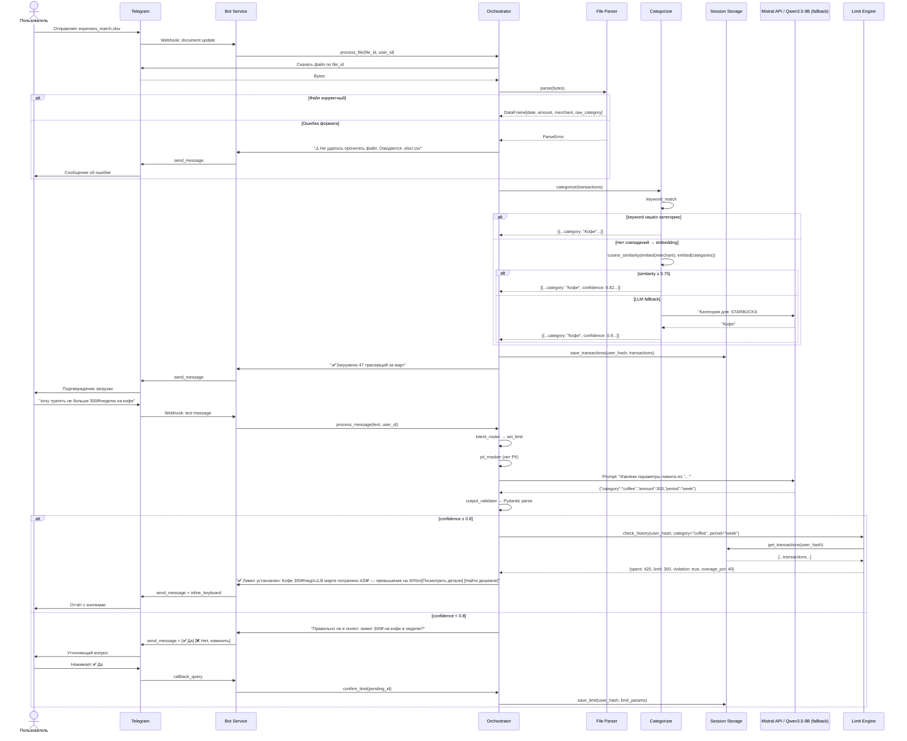
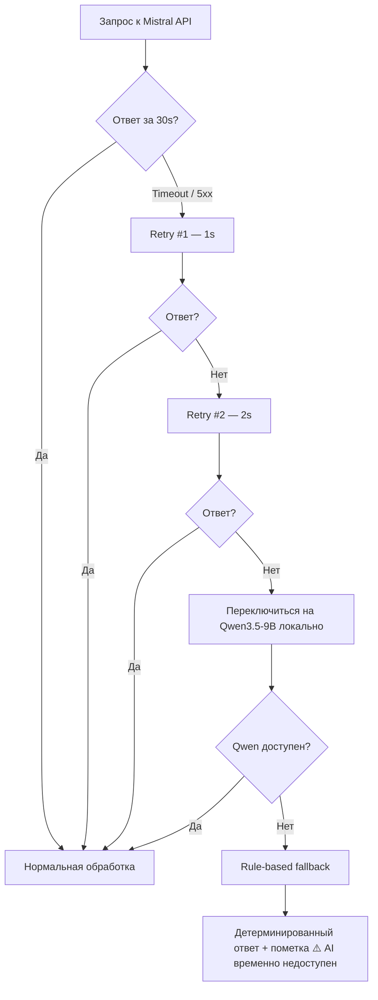
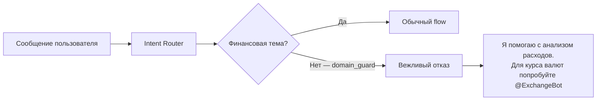

# Workflow Diagram — PFA

> Пошаговое выполнение запроса включая ветки ошибок.

## Happy Path: загрузка файла + установка лимита

```mermaid
sequenceDiagram
    actor U as Пользователь
    participant TG as Telegram
    participant Bot as Bot Service
    participant Orch as Orchestrator
    participant FP as File Parser
    participant Cat as Categorizer
    participant SS as Session Storage
    participant LLM as Mistral API / Qwen3.5-9B (fallback)
    participant LE as Limit Engine

    U->>TG: Отправляет expenses_march.xlsx
    TG->>Bot: Webhook: document update
    Bot->>Orch: process_file(file_id, user_id)
    Orch->>TG: Скачать файл по file_id
    TG-->>Orch: Bytes

    Orch->>FP: parse(bytes)
    alt Файл корректный
        FP-->>Orch: DataFrame[date, amount, merchant, raw_category]
    else Ошибка формата
        FP-->>Orch: ParseError
        Orch->>Bot: "⚠️ Не удалось прочитать файл. Ожидается .xlsx/.csv"
        Bot->>TG: send_message
        TG->>U: Сообщение об ошибке
    end

    Orch->>Cat: categorize(transactions)
    Cat->>Cat: keyword_match
    alt keyword нашёл категорию
        Cat-->>Orch: [{...category: "Кофе"...}]
    else Нет совпадений → embedding
        Cat->>Cat: cosine_similarity(embed(merchant), embed(categories))
        alt similarity ≥ 0.75
            Cat-->>Orch: [{...category: "Кофе", confidence: 0.82...}]
        else LLM fallback
            Cat->>LLM: "Категория для: STARBUCKS #1234?"
            LLM-->>Cat: "Кофе"
            Cat-->>Orch: [{...category: "Кофе", confidence: 0.9...}]
        end
    end

    Orch->>SS: save_transactions(user_hash, transactions)
    Orch->>Bot: "✅ Загружено 47 транзакций за март"
    Bot->>TG: send_message
    TG->>U: Подтверждение загрузки

    U->>TG: "хочу тратить не больше 300₽/неделю на кофе"
    TG->>Bot: Webhook: text message
    Bot->>Orch: process_message(text, user_id)

    Orch->>Orch: intent_router → set_limit
    Orch->>Orch: pii_masker (нет PII)
    Orch->>LLM: Prompt: "Извлеки параметры лимита из: '...'"
    LLM-->>Orch: {"category":"coffee","amount":300,"period":"week"}

    Orch->>Orch: output_validator → Pydantic parse
    alt confidence ≥ 0.8
        Orch->>LE: check_history(user_hash, category="coffee", period="week")
        LE->>SS: get_transactions(user_hash)
        SS-->>LE: [...transactions...]
        LE-->>Orch: {spent: 420, limit: 300, violation: true, overage_pct: 40}

        Orch->>Bot: "✅ Лимит установлен: Кофе 300₽/нед\n⚠️ В марте потрачено 420₽ — превышение на 40%\n[Посмотреть детали] [Найти дешевле]"
        Bot->>TG: send_message + inline_keyboard
        TG->>U: Отчёт с кнопками
    else confidence < 0.8
        Orch->>Bot: "Правильно ли я понял: лимит 300₽ на кофе в неделю?"
        Bot->>TG: send_message + [✅ Да] [❌ Нет, изменить]
        TG->>U: Уточняющий вопрос
        U->>TG: Нажимает ✅ Да
        TG->>Bot: callback_query
        Bot->>Orch: confirm_limit(pending_id)
        Orch->>SS: save_limit(user_hash, limit_params)
    end
```

## Ветка: LLM недоступен

```mermaid
flowchart TD
    A[Запрос к Mistral API] --> B{Ответ за 30s?}
    B -->|Да| C[Нормальная обработка]
    B -->|Timeout / 5xx| D[Retry #1 — 1s]
    D --> E{Ответ?}
    E -->|Да| C
    E -->|Нет| F[Retry #2 — 2s]
    F --> G{Ответ?}
    G -->|Да| C
    G -->|Нет| H[Переключиться на Qwen3.5-9B локально]
    H --> I{Qwen доступен?}
    I -->|Да| C
    I -->|Нет| J[Rule-based fallback]
    J --> K[Детерминированный ответ + пометка ⚠️ AI временно недоступен]
```

## Ветка: out-of-domain запрос

```mermaid
flowchart LR
    A[Сообщение пользователя] --> B[Intent Router]
    B --> C{Финансовая тема?}
    C -->|Да| D[Обычный flow]
    C -->|Нет — domain_guard| E[Вежливый отказ]
    E --> F["Я помогаю с анализом расходов.\nДля курса валют попробуйте @ExchangeBot"]
```
