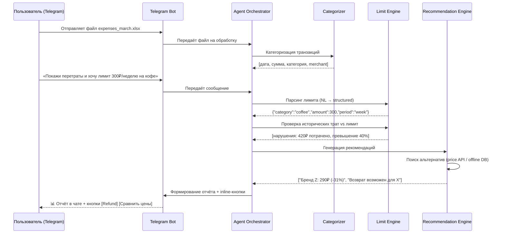
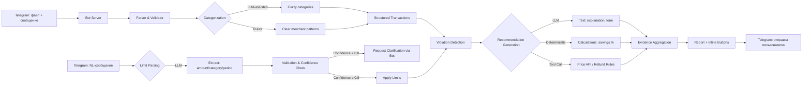

## 1. 🎯 Обоснование идеи

### 1.1 Прикладная задача
Пользователи, ведущие учёт личных финансов (в Excel, CSV или выгрузках из банков), сталкиваются с тремя основными проблемами:

| Проблема | Последствия | Как решает наш продукт |
|----------|-------------|----------------------|
| **Ручной анализ трат** | Тратится 30-60 мин/неделю на категоризацию и поиск инсайтов | ✅ Автоматическая категоризация + NL-интерфейс в Telegram: «Покажи, где я перетратил» |
| **Сложность контроля импульсивных покупок** | Лимиты устанавливаются «на словах», нет механизма напоминаний | ✅ Гибкие лимиты через сообщения: «не хочу тратить >500₽ на десерты в неделю» |
| **Отсутствие персонализированных советов** | Общие рекомендации «экономьте больше» не работают | ✅ Конкретные действия в чате: «Верните покупку X», «Товар Y дешевле в магазине Z на 15%» |

### 1.2 Уникальное торговое предложение (USP)
> **«Финансовый ассистент в вашем Telegram: отправляйте выписку файлом, задавайте вопросы как в чате с другом, получайте инсайты без установки дополнительных приложений»**.

**Ключевые дифференциаторы:**
- 📱 **Telegram-first**: не нужно скачивать отдельное приложение — всё в привычном мессенджере
- 🗣️ **Natural Language Limits**: лимиты задаются сообщениями как в разговоре — без форм и настроек
- 🔒 **Local-first Privacy**: все данные обрабатываются на защищённом сервере; Telegram ID хэшируется
- 🎯 **Action-Oriented**: не просто аналитика, а конкретные шаги с кнопками: [Вернуть] [Сравнить цены]
- ⚡ **Time-to-Value < 2 мин**: от отправки файла до первого инсайта — менее 120 секунд

### 1.3 Анализ конкурентов
| Продукт | Канал | Сильные стороны | Слабые стороны | Наше преимущество |
|---------|-------|----------------|----------------|-----------------|
| **Mint / YNAB** | Web/Mobile | Богатая визуализация, банковские интеграции | Требует отдельного приложения, сложный onboarding | 📱 Всё в Telegram, не нужно регистрироваться |
| **Copilot Money** | Mobile | AI-инсайты, красивый UI | Платная подписка, cloud-only | 🔒 Локальная обработка; прозрачная логика |
| **Cleo / Plum** | Mobile/Chat | Голосовой интерфейс, геймификация | Навязывание партнёров, ограниченная аналитика | 🎯 Фокус на действиях с evidence |
| **Excel / Google Sheets** | Desktop | Полный контроль, гибкость | Требует ручного труда, нет AI-помощника | 🤖 Автоматизация рутины + инсайты |

---

## 2. 📊 Цель и метрики успеха

### 2.1 Цель проекта (PoC)
> Продемонстрировать техническую реализуемость и пользовательскую ценность AI-агента для анализа расходов через Telegram Bot за 2-3 недели разработки.

**Критерии успеха PoC:**
- ✅ Пользователь может отправить `.xlsx/.csv` файл в бота и получить отчёт за < 2 мин
- ✅ Агент корректно извлекает лимиты из NL-сообщений в ≥ 90% тестовых кейсов
- ✅ Рекомендации содержат проверяемое обоснование (источник данных)
- ✅ Все вычисления выполняются на сервере без отправки данных в сторонние LLM API (по умолчанию)

### 2.2 Продуктовые метрики
| Метрика | Целевое значение (PoC) | Метод измерения | Приоритет |
|---------|----------------------|-----------------|-----------|
| **Time-to-first-insight** | < 90 сек (p95) | Логирование: получение файла → отправка отчёта | 🔴 High |
| **Task Success Rate** | ≥ 85% | % сообщений, где пользователь получил релевантный ответ без уточнений | 🔴 High |
| **Action Conversion Rate** | ≥ 25% | % пользователей, нажавших на inline-кнопку (refund/cheaper) в демо-сессии | 🟡 Medium |
| **User Satisfaction (CSAT)** | ≥ 4.2 / 5.0 | Опрос через бота: «Насколько полезен был ассистент?» (1-5) | 🟡 Medium |
| **Limit Parsing Accuracy** | ≥ 90% F1 | Тестовый набор NL-сообщений → извлечённые параметры | 🔴 High |
| **Message Response Time** | < 5 сек (p95) | Время от сообщения пользователя до ответа бота | 🟡 Medium |

### 2.3 Агентские метрики (по Confident AI Guide)
| Метрика | Уровень | Описание | Целевое значение |
|---------|---------|----------|-----------------|
| **Task Completion** | End-to-end | % запросов, где агент корректно проанализировал траты и предложил релевантное действие | ≥ 85% |
| **Argument Correctness** | Component | Точность извлечения параметров лимитов из NL: сумма, категория, период | F1 ≥ 0.90 |
| **Tool Correctness** | Component | Корректность вызова инструментов: категоризатор, comparator цен, refund-checker | ≥ 95% success rate |
| **Reasoning Relevancy** | Component | Логичность цепочки: «пользователь хочет сэкономить → найдена альтернатива → объяснение выгоды» | ≥ 4.0 / 5.0 (human eval) |
| **Hallucination Rate** | Safety | % рекомендаций, не подтверждённых данными или выдуманных источников | < 2% |
| **Recovery Rate** | Robustness | % случаев, когда агент корректно обрабатывает edge-кейс (нечёткий ввод, ошибка API) | ≥ 80% |

### 2.4 Технические метрики
| Метрика | Целевое значение (PoC) | Инструмент измерения |
|---------|----------------------|---------------------|
| **p95 latency** (анализ 1000 строк) | < 15 сек | Логирование времени обработки |
| **Memory usage** (Server) | < 2 GB | `docker stats`, cgroups |
| **Categorization F1-score** | ≥ 0.92 | Тестовый датасет с gold labels |
| **Error rate** (бот недоступен) | < 1% | Telegram Bot API status, health checks |
| **Bot uptime** | ≥ 95% | Мониторинг доступности вебхука |
| **Max concurrent users** | 50 (PoC) | Нагрузочное тестирование |

---

## 3. 🎬 Потенциальные сценарии использования

### 3.1 Основной сценарий (Happy Path)


### 3.2 Команды бота
| Команда | Описание | Пример ответа |
|---------|----------|---------------|
| `/start` | Начало работы, инструкция | «Привет! Отправь мне файл с выпиской (.xlsx/.csv)» |
| `/help` | Список доступных команд | «/analyze, /limits, /report, /settings» |
| `/analyze` | Запуск анализа последнего файла | «Анализирую expenses_march.xlsx...» |
| `/limits` | Показать текущие лимиты | «Кофе: 300₽/неделю (потрачено 420₽ ⚠️)» |
| `/report` | Генерация отчёта за период | «Отчёт за март: [файл PDF]» |
| `/settings` | Настройки (API, уведомления) | Inline-меню с опциями |
| `/delete` | Удалить все данные | «Все ваши данные удалены ✅» |

### 3.3 Edge-кейсы и обработка ошибок
| Кейс | Описание | Стратегия обработки |
|------|----------|-------------------|
| **Нечёткая категория** | Пользователь пишет «что-то в Starbucks» | Fuzzy-matching по merchant + сообщение: «Это кофе или еда?» (inline-кнопки) |
| **Конфликт лимитов** | «Не тратить на еду» + «обед до 500₽» | Приоритизация: конкретный лимит > общий; объяснение в сообщении |
| **Missing / corrupted data** | Пустые строки, неверные форматы дат в Excel | Сообщение: «⚠️ Найдено 3 строки с ошибками, пропущены» |
| **Запрос вне домена** | «Какой курс доллара?» / «Напиши стих» | Вежливый отказ: «Я помогаю с анализом расходов. Для курса попробуйте @ExchangeBot» |
| **API недоступен** | Price comparison API таймаутит | Fallback на офлайн-базу цен; сообщение: «⚠️ Данные устарели» |
| **Low confidence в NL-парсинге** | Агент не уверен в извлечённых параметрах лимита | Сообщение: «Правильно ли я понял: лимит 300₽ на кофе в неделю?» [✅ Да] [❌ Нет] |
| **Большой файл (>50 MB)** | Превышение лимита Telegram | Сообщение: «Файл слишком большой (макс. 50 MB). Отправьте за месяц частями» |
| **Файл не того формата** | Пользователь отправил PDF/фото | Сообщение: «Пожалуйста, отправьте .xlsx или .csv файл» |
| **Rate limit превышен** | Слишком много запросов подряд | Сообщение: «Подождите 30 сек перед следующим запросом» |

### 3.4 Сценарии для разных типов пользователей
| Тип пользователя | Потребность | Адаптация в боте |
|-----------------|-------------|-----------------|
| **Новичок в учёте финансов** | Простота, быстрый старт | Приветственное сообщение с инструкцией, шаблоны лимитов |
| **Продвинутый пользователь** | Гибкость, экспорт, кастомизация | Команды `/settings`, `/export`, JSON-конфиги через чат |
| **Privacy-conscious** | Локальная обработка, минимум данных | Команда `/privacy` — режим «offline-only», отключение API |
| **Командный use-case** (семья) | Совместный контроль бюджета | (Фаза 2) Семейный чат, экспорт отчёта для шеринга |

---

## 4. ⚠️ Ограничения

### 4.1 Технические ограничения (PoC)
| Параметр | Значение | Обоснование |
|----------|----------|-------------|
| **SLO (доступность бота)** | 95% в рабочее время демо | PoC, не production; допустимы короткие простои |
| **p95 latency** | < 15 сек для файлов ≤ 5000 строк | Баланс между скоростью и качеством анализа на CPU |
| **Макс. размер файла** | 50 MB | Ограничение Telegram Bot API |
| **Поддерживаемые форматы** | `.xlsx`, `.csv` (UTF-8) | Наиболее распространённые форматы экспорта из банков |
| **Языки NL-запросов** | Русский (основной), английский (базовый) | Фокус на RU-рынок; мультиязычность — фаза 2 |
| **Модель LLM** | Локальная 7B (Qwen2.5 / Llama-3) или API (opt-in) | Баланс качества / стоимости / приватности |
| **Max concurrent users** | 50 (PoC) | Ограничение ресурсов сервера |

### 4.2 Ограничения Telegram Bot API
| Параметр | Значение | Комментарий |
|----------|----------|-------------|
| **Max file size** | 50 MB | Для больших выписок — разбивать на части |
| **Message length** | 4096 символов | Длинные отчёты — отправлять файлом |
| **Inline buttons** | До 100 кнопок на сообщение | Для действий (refund/compare) |
| **Rate limiting** | ~30 сообщений/сек на бота | Нужно учитывать при масштабировании |
| **Webhook timeout** | 60 сек | Долгие задачи — через background job + уведомление |

### 4.3 Операционные ограничения
| Параметр | Значение | Комментарий |
|----------|----------|-------------|
| **Бюджет разработки PoC** | ≤ 20 чел/часов | Фокус на минимальный working demo |
| **Инфраструктура** | VPS + Docker; серверный бот | Вебхук или long-polling |
| **Поддержка** | Self-service + `/help`; no SLA | PoC для демонстрации концепции |
| **Данные для тестов** | Только анонимизированные синтетические датасеты | Соответствие privacy-by-design |
| **Команда** | 1-2 разработчика, part-time | Ограниченный bandwidth → приоритизация core-фич |

### 4.4 Out-of-Scope для PoC
```markdown
❌ Интеграция с банками в реальном времени (только файловый импорт)  
❌ Мульти-пользовательские сценарии и шеринг данных  
❌ Прогнозирование доходов / инвестиционные рекомендации  
❌ Мобильное приложение (только Telegram Bot)  
❌ Обучение модели на пользовательских данных (все вычисления — stateless)  
❌ Полное соответствие GDPR/152-ФЗ (базовые меры privacy — да, юридическая сертификация — фаза 2)  
❌ Поддержка более 5 языков (фокус на RU/EN)  
❌ Голосовые сообщения как ввод (только текст и файлы)  
```

---

## 5. 🏗️ Архитектурный набросок

### 5.1 Высокоуровневая архитектура
```
┌─────────────────────────────────┐
│      Telegram Users             │
│  (Mobile / Desktop clients)     │
└────────────┬────────────────────┘
             │ HTTPS (Bot API)
┌────────────▼────────────────────┐
│      Telegram Bot Server        │
│  • python-telegram-bot / aiogram│
│  • Webhook / Long-polling       │
│  • Message routing              │
└────────────┬────────────────────┘
             │
┌────────────▼────────────────────┐
│     Agent Orchestrator          │
│  • LangChain / LlamaIndex       │
│  • NL-парсинг лимитов           │
│  • Планирование шагов (ReAct)   │
│  • Управление контекстом        │
└────────────┬────────────────────┘
             │
    ┌────────┴────────┐
    │                 │
┌───▼────┐      ┌────▼─────┐
│Categorizer│    │Limit Engine│
│• Rules +  │    │• NL → struct│
│  ML fallback│  │• Проверка лимитов│
│• F1 ≥ 0.92 │    │• Приоритизация│
└───┬────┘      └────┬─────┘
    │                 │
┌───▼─────────────────▼────┐
│     Recommendation Engine │
│  • Refund checker (rules) │
│  • Price comparator (API/offline)│
│  • Evidence aggregator    │
└────────────┬──────────────┘
             │
┌────────────▼──────────────┐
│     Report Generator      │
│  • Markdown / PDF export  │
│  • Inline buttons (UX)    │
│  • XAI-lite explanations  │
└────────────┬──────────────┘
             │
┌────────────▼──────────────┐
│     Storage Layer         │
│  • PostgreSQL (sessions)  │
│  • Redis (cache)          │
│  • Local FS (temp files)  │
└───────────────────────────┘
```

### 5.2 Ключевые модули и интеграции
| Модуль | Технология (PoC) | Ответственность | Интеграции |
|--------|-----------------|-----------------|------------|
| **Telegram Bot** | `aiogram 3.x` / `python-telegram-bot` | Приём сообщений, файлов, отправка ответов | Telegram Bot API |
| **File Parser** | `pandas`, `openpyxl` | Загрузка и валидация `.xlsx/.csv` из Telegram | — |
| **Categorizer** | Hybrid: rules + `sentence-transformers` | Присвоение категории транзакции | Опционально: external taxonomy API |
| **NL Limit Parser** | LLM (Qwen2.5-7B / GPT-4o-mini) + few-shot prompts | Извлечение {category, amount, period} из NL | — |
| **Limit Engine** | Deterministic Python | Проверка трат vs лимиты, приоритизация | — |
| **Price Comparator** | `requests` + caching | Поиск альтернатив по цене | Price API (opt-in), offline DB |
| **Refund Checker** | Rules-based engine | Проверка политик возврата | — |
| **Report Generator** | `jinja2`, `markdown`, `reportlab` | Формирование отчёта + inline-кнопки | — |
| **Security Layer** | Custom sanitizers + config | Санитизация ввода, masking PII, Telegram ID hashing | — |
| **Session Storage** | JSON files + in-memory dict (PoC) | Простое хранение без внешних зависимостей |

### 5.3 Data Flow: что делегируем LLM, что — нет


**✅ Делегируем LLM/Agent:**
- Понимание естественного языка (лимиты, запросы к данным)
- Генерация текста сообщений с учётом тона и контекста
- Классификация нечётких категорий (с fallback на rules)
- Синтез объяснений «почему это предложено» (XAI-lite)

**❌ НЕ делегируем LLM (только детерминированный код):**
- Арифметические вычисления: суммы, проценты, сравнения
- Валидация данных: форматы дат, диапазоны сумм
- Доступ к файловой системе и внешним API (через изолированные инструменты)
- Логирование, аутентификация, шифрование
- Принятие критических решений (требует confirmation step via inline buttons)

**🔒 Безопасность data flow:**
- Все внешние вызовы — через sandboxed tools с валидацией ответов
- PII маскируется до передачи в LLM
- Telegram ID хэшируется перед сохранением (SHA-256 + salt)
- Контекст LLM ограничивается системным промптом + необходимыми данными

---

## 6. 📈 Дорожная карта (после PoC)

| Фаза | Цель | Ключевые фичи | Оценка усилий |
|------|------|---------------|---------------|
| **PoC (текущая)** | Доказать концепцию | Telegram Bot, NL-лимиты, базовая аналитика | 2-3 недели |
| **Alpha** | Улучшение качества | Fine-tune категоризатора, расширенные edge-кейсы, уведомления о лимитах | +3-4 недели |
| **Beta** | Подготовка к пользователям | Мультиязычность, офлайн-режим, семейный доступ | +4-6 недель |
| **v1.0** | Коммерческая готовность | Интеграции с банками (read-only), compliance (GDPR/152-ФЗ), мониторинг | +2-3 месяца |

---

## 7. 🔐 Telegram-Specific Security Considerations

### 7.1 Что хранится о пользователе
| Данные | Хранение | Цель |
|--------|----------|------|
| Telegram ID | Хэш (SHA-256 + salt) | Идентификация сессии |
| Username | Не хранится | — |
| Имя/фамилия | Не хранится | — |
| Номер телефона | Не доступен боту | Telegram не передаёт |
| Файлы выписок | Временно (до 7 дней), шифруются | Анализ расходов |
| История сообщений | До 20 последних (для контекста) | NL-понимание запросов |

### 7.2 Telegram Bot API Security
| Мера | Реализация |
|------|------------|
| **Bot Token** | Хранится в `.env`, не коммитится в git |
| **Webhook** | HTTPS с валидацией сертификата Telegram |
| **Rate Limiting** | `aiogram` middleware + Redis counter |
| **Input Validation** | Санитизация всех текстовых сообщений перед LLM |
| **File Validation** | Проверка MIME-type, размера, расширение |
